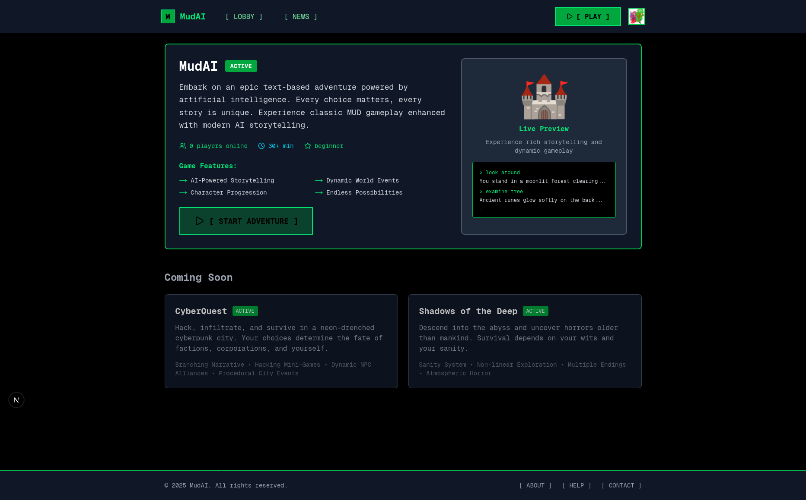
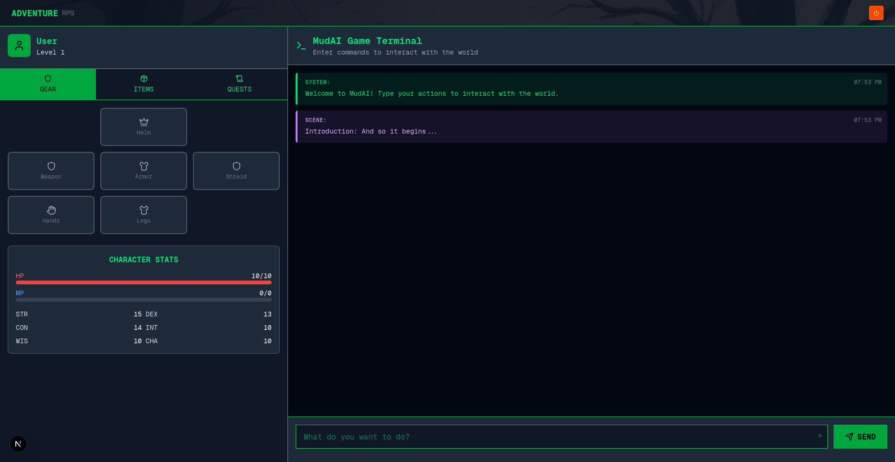
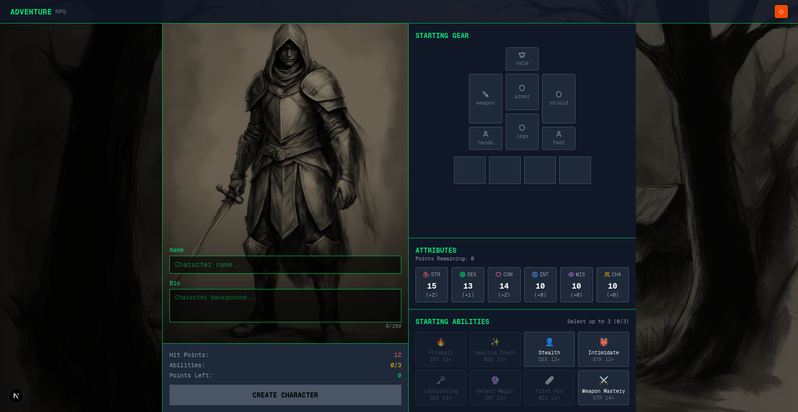

# AI MUD (Multi-User Dungeon)

A browser-based, AI-powered text adventure inspired by classic MUDs. The game leverages locally-hosted AI models to parse user input, generate narration, and simulate NPC or game engine actions dynamically.

*Note: This project is currently in active development. Some features may be incomplete or subject to change.*

## Features

- **Dynamic AI Narration**: User actions are parsed by an LLM into structured JSON, then another LLM generates immersive game master-style narration
- **Persistent Game State**: Each player's session is saved in the database with full game state, including player stats, NPCs, inventory, and story progression
- **Multi-User Support**: Multiple users can play simultaneously with unique user accounts and independent game sessions
- **Customizable Game Engines**: Each "world" or "game" has its own engine with independent rules and logic
- **REST API & WebSocket Ready**: Designed for fast interactions. Currently uses REST, with optional WebSocket support for async updates
- **OAuth Authentication**: Secure Google OAuth integration with persistent user accounts

## Architecture

The application uses a **3-tier microservice architecture** for optimal resource management and scalability:

### 1. Frontend (Next.js) - Port 3000
- React-based user interface
- Authentication and session management
- Real-time game interaction

### 2. Game API Server (FastAPI) - Port 8000
- Game logic and session management
- Database operations and user management
- WebSocket support for real-time updates
- Communicates with model service via HTTP client

### 3. AI Model Service (FastAPI) - Port 8001
- **Decoupled AI inference service**
- CodeLlama-7B for parsing player actions into structured JSON
- Ministral-8B for generating dynamic game narration
- Independent model loading/unloading
- GPU resource management and memory optimization
- Batch processing support for multiple requests

This separation allows the AI models to run independently, enabling better resource management, easier scaling, and the ability to restart services without affecting the entire application.

## Tech Stack

### Backend
- **Python** with **FastAPI** for high-performance async API
- **PostgreSQL** for persistent data storage
- **asyncio** for concurrent game engine management
- **Prisma** Python client for database ORM
- **Decoupled AI Model Service** running on separate port for better resource management

### Frontend
- **Next.js 15** with React 19
- **TypeScript** for type safety
- **TailwindCSS** for styling
- **NextAuth.js** for authentication
- **Prisma** TypeScript client

### AI Models (Self-Hosted)
- **CodeLlama-7B-Instruct-HF**: Parses user input into structured JSON
- **Ministral-8B-Instruct-2410-GGUF**: Generates dynamic game narration

## Prerequisites

- **Python 3.8+**
- **Node.js 18+**
- **PostgreSQL** database
- **CUDA-compatible GPU** (recommended for AI model inference)
- **Google OAuth credentials** (for authentication)

## Installation

### Backend Setup

1. Clone the repository and navigate to the backend directory:
```bash
git clone <your-repo-url>
cd <project-name>
```

2. Create a Python virtual environment:
```bash
python -m venv venv
source venv/bin/activate  # On Windows: venv\Scripts\activate
```

3. Install Python dependencies:
```bash
pip install -r requirements.txt
```

4. Set up your environment variables:
```bash
cp .env.example .env
# Edit .env with your database URL, OAuth credentials, etc.
```

5. Set up the database:
```bash
# Initialize Prisma and run migrations
prisma generate --schema=prisma/schema.prisma
prisma db push --schema=prisma/schema.prisma
```

### Frontend Setup

1. Navigate to the frontend directory:
```bash
cd frontend
```

2. Install Node.js dependencies:
```bash
npm install
```

3. Set up frontend environment variables:
```bash
cp .env.example .env.local
# Edit .env.local with your API URLs and auth settings
```

### AI Model Setup

1. Download the required models:
   - CodeLlama-7B-Instruct-HF
   - Ministral-8B-Instruct-2410-GGUF

2. Configure model paths in your backend environment variables

## Running the Application

### Quick Start with Start Script (Recommended)

The project includes a `start.sh` script for automatic backend service orchestration:

```bash
# First, activate your Python virtual environment
source venv/bin/activate

# Make the script executable (first time only)  
chmod +x start.sh

# Start both backend services automatically
./start.sh
```

The `start.sh` script will automatically:
- Start the AI Model Service on port 8001 with models pre-loaded
- Wait for model service health checks to pass  
- Start the Game API Server on port 8000
- Verify both services are running correctly
- Display useful development endpoints and health check URLs
- Handle graceful shutdown when you press Ctrl+C

**Important:** The start script must be run from within the activated Python virtual environment.

### Start the Frontend

In a separate terminal:
```bash
cd frontend
npm run dev
```

### Manual Start (Alternative)

If you prefer to start services manually:

1. **Start the AI Model Service:**
```bash
source venv/bin/activate
python -m backend.services.ai_models.model_server --host 0.0.0.0 --port 8001 --load-models
```

2. **Start the Game API Server:**
```bash 
source venv/bin/activate
python server.py
```

3. **Start the Frontend:**
```bash
cd frontend
npm run dev
```

### Service URLs
- **Frontend**: http://localhost:3000
- **Game API**: http://localhost:8000  
- **Model Service**: http://localhost:8001

### Health Checks
- Game API health: `curl http://localhost:8000/health`
- Model service health: `curl http://localhost:8001/health`
- Model status: `curl http://localhost:8001/status`

## Screenshots

### Game Lobby

*Browse available game worlds and create new sessions*

### Gameplay Interface

*Interactive text adventure with AI-generated narration*

### Character Creation

*Create and customize your character before starting*

## Usage

1. **Sign In**: Use Google OAuth to create an account
2. **Create/Join Game**: Start a new adventure or continue an existing game session
3. **Play**: Type natural language commands (e.g., "look around", "pick up the sword", "talk to the merchant")
4. **Experience**: Watch as AI parses your input and generates dynamic, contextual narration

## API Endpoints

### Game API Server (Port 8000)

#### Health & Status
- `GET /health` - Health check with model service status
- `GET /models/status` - Get AI model service status via proxy

#### Game Lobby
- `GET /lobby` - List all available games
- `GET /lobby/{game_slug}` - Get detailed game information

#### Game Sessions
- `GET /play/{slug}/{user_id}` - Get session status for user
- `POST /play/{slug}/{user_id}` - Create new game session
- `DELETE /play/{slug}/{user_id}` - Delete/end game session
- `GET /play/{slug}/{session_id}/{user_id}` - Get specific session data
- `POST /play/{slug}/{session_id}/action/{user_id}` - Submit player action

#### AI Model Management (Proxy)
- `POST /models/load` - Load AI models via model service
- `POST /models/unload` - Unload AI models via model service 
- `POST /models/reload` - Reload AI models via model service

#### Testing & Development
- `POST /test/parse_action` - Test action parsing
- `POST /test/generate_action` - Test action narration
- `POST /test/generate_scene` - Test scene generation

### AI Model Service (Port 8001)

#### Health & Status  
- `GET /health` - Model service health with resource usage
- `GET /status` - Detailed model and memory status

#### Model Management
- `POST /models/load` - Load CodeLlama and Ministral models
- `POST /models/unload` - Unload all models from memory
- `POST /models/reload` - Reload models (unload + load)

#### AI Inference
- `POST /parse_action` - Parse natural language into structured JSON
- `POST /generate_action` - Generate narration for player actions
- `POST /generate_scene` - Generate scene descriptions
- `POST /batch/parse_actions` - Batch process multiple actions

*Note: API documentation is currently in development*

## Contributing

1. Fork the repository
2. Create a feature branch: `git checkout -b feature-name`
3. Commit your changes: `git commit -m 'Add feature'`
4. Push to the branch: `git push origin feature-name`
5. Submit a pull request

## License

This project is licensed under the MIT License - see the [LICENSE](LICENSE) file for details.

## Acknowledgments

- Inspired by classic text-based MUDs and modern AI capabilities
- Built with modern web technologies for optimal performance
- Designed for extensibility and community contribution